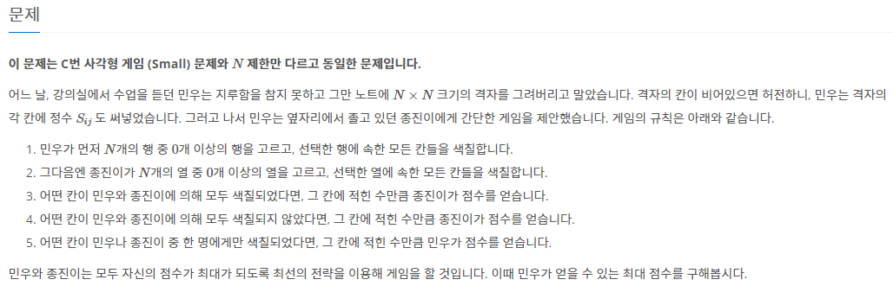

## BOJ 25046/25047 사각형 게임

[link](https://boj.kr/25047)

### 문제

문제가 길다. 사진으로...


### 풀이
  
종진이는 민우가 어떻게 색칠해도 본인이 더 많은 점수를 얻기 위해 색칠을 한다.
그래서 민우가 행을 칠하는 모든 경우에 대해서 종진이의 판단을 구현해주었다.
N이 작아서 완전탐색이 가능하다.

### 소스코드

> [C++](https://github.com/Kadrick/PS/blob/main/BOJ/25047.cpp)

```cpp
/**
 * @file 25047.cpp
 * @author Kadrick (kbk2581553@gmail.com)
 * @brief brute force, implement
 * @version 0.1
 * @date 2022-05-03 14:38
 *
 * @copyright Copyright (c) 2022
 *
 */
#include <bits/stdc++.h>
using namespace std;
#define fastio                 \
  ios::sync_with_stdio(false); \
  cin.tie(0);
#define endl '\n'

#define int long long

int n, ans = LLONG_MIN; // "정수"가 주어진다.
vector<int> row;
vector<vector<int>> board;

int32_t main(void)
{
  fastio;

  cin >> n;
  board.resize(n, vector<int>(n));
  for (int i = 0; i < n; i++)
  {
    int sum = 0;
    for (int j = 0; j < n; j++)
    {
      cin >> board[i][j];
      sum += board[i][j];
    }
    row.push_back(sum);
  }

  // 민우가 행을 선택하는 모든 경우
  for (int way = 0; way < (1 << n); way++)
  {
    int score = 0;

    // 우선 모든 선택한 모든 행의 점수더하기
    for (int i = 0; i < n; i++)
    {
      if (way & (1 << i))
        score += row[i];
    }

    // 열 기준으로 보기 (종진이의 판단)
    for (int j = 0; j < n; j++)
    {
      int mscore, jscore;
      mscore = jscore = 0;
      // 행마다 민우가 칠한 상황에 따라 점수 계산
      for (int i = 0; i < n; i++)
      {
        if (way & (1 << i))
        {
          mscore -= board[i][j];
          jscore += board[i][j];
        }
        else
        {
          mscore += board[i][j];
          jscore -= board[i][j]; // 안 칠했을 때는 이만큼의 이득이 있다는 의미임
        }
      }

      // 결국 종진이가 칠하는게 이득이라면 칠했을 때로 업데이트
      if (jscore > 0)
        score += mscore;
    }

    ans = max(ans, score);
  }

  cout << ans << endl;

  return 0;
}
```
