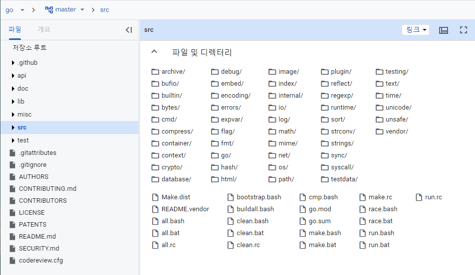

## Go study - syntax - 1

### Hello world

다음은 Hello, world! 이다.

```go
// main.go
package main

import "fmt"

func main() {
  fmt.Println("Hello, world")
}
```

main package가 있고, "[fmt](https://pkg.go.dev/fmt)" 라는 것을 import 하고, 그곳에 있는 println이라는 method를 이용한다. 자바와 상당이 유사하다고 생각된다. import하는 package는 어떤 게 있을까?

> [Google Go Page](https://cs.opensource.google/go/go/+/master:)

첫 번째로 위의 사이트의 src directory 밑에 있는 package는 모두 사용 가능 하다. bufio, math, sort 같은 것들을 확인할 수 있다.



두 번째로 Github 같은 곳에서 package를 가져올 수 있다.

[echo](https://pkg.go.dev/github.com/labstack/echo/v4) 라는 package를 사용하는 예제이다.

```go
package main

import (
  "github.com/labstack/echo/v4"
  "github.com/labstack/echo/v4/middleware"
  "net/http"
)

func main() {
  // Echo instance
  e := echo.New()

  // Middleware
  e.Use(middleware.Logger())
  e.Use(middleware.Recover())

  // Routes
  e.GET("/", hello)

  // Start server
  e.Logger.Fatal(e.Start(":1323"))
}

// Handler
func hello(c echo.Context) error {
  return c.String(http.StatusOK, "Hello, World!")
}
```

doc의 설명을 읽어보면 install을 하고 다음과 같이 import에 명시해주기만 하면 된다.

```sh
// go get github.com/labstack/echo/{version}
go get github.com/labstack/echo/v4
```

Go의 버전이 높다면 get 커맨드로 install이 되지 않는다. **install**을 이용하여야 한다.

```sh
go install github.com/labstack/echo/v4@latest
```

이런 식으로 사용하면 된다.

---

다시 Hello, world!로 돌아가면 ;(세미콜론)도 없는 것을 확인할 수 있다. 컴파일 시에 문장 끝에 자동으로 ;을 삽입한다. 명시해도 상관없는 것으로 알고 있는데, vscode 설치 후 저장 시에 어차피 붙어있는 ;도 없애기에 앞으로는 ;없이 코드를 작성할 것 같다.

---

주석은 C 처럼 /**/ 사이에 작성해도 되고, //을 사용해도 된다.

---

Go 에서는 {}(중괄호)의 위치를 따진다. 함수 선언, 제어문 뒤에 오는 여는 중괄호는 반드시 줄 바꿈을 하지 않고 바로 뒤에 작성해야 한다. 말로 하면 어렵다. 예시를 보면 바로 이해할 수 있다.

```go
// main.go
package main

import "fmt"
/*
// 이런 형식이 불가능하다.
func main() 
{
 fmt.Println("Hello, world")
}
*/

func main() {
  fmt.Println("Hello, world")
}
```

---

### Variables, 변수

Go 에서의 변수의 사용과 자료형에 대해서 알아보자.

#### Declaration, 변수를 사용해보자

기본적인 변수 선언은 키워드 **var, const** 을 통해서 진행한다. "< var | const > < 변수 이름 > < 자료형 >" 형식으로 사용한다. var은 일반적인 변수, cosnt는 상수를 의미한다.

선언과 정의를 동시에 하기 위해서 ":=" 을 사용할 수 있는데 전역으로 사용은 불가능하다.

```go
package main

import "fmt"

const num3 int = 4

func main() {
  // 변수 선언시 초기화 하지 않으면 자동으로 자료형에 맞는 기본값으로 초기화
  // int: 0, bool: flase 로 초기화 된다. string은 빈문자열 이런 식으로...
  var num1 int
  vsar num2 int = 1
  num1 = 2

  fmt.Printf("%d %d", num1+num2, num3)
}
```


#### Data Type, 변수의 그릇

Go의 자료형은 [document](https://go.dev/ref/spec#Types)를 확인하면 알 수 있다. 영어라서 어질어질하지만 요약하면 아래의 표가 된다.

|    type    |              description              | byte  |
| :--------: | :-----------------------------------: | :---: |
|    bool    |              true, false              |   1   |
|   uint8    |       음수를 제외한 1byte 정수        |   1   |
|   uint16   |       음수를 제외한 2byte 정수        |   2   |
|   uint32   |       음수를 제외한 4byte 정수        |   4   |
|   uint64   |       음수를 제외한 8byte 정수        |   8   |
|    int8    |              1byte 정수               |   1   |
|   int16    |              2byte 정수               |   2   |
|   int32    |              4byte 정수               |   4   |
|   int64    |              8byte 정수               |   8   |
|  float32   |              4byte 실수               |   4   |
|  float64   |              8byte 실수               |   8   |
| complex64  |        float32 실수부와 허수부        |   8   |
| complex128 |        flaot64 실수부와 허수부        |   8   |
| int, uint  |      아키텍쳐에 따라 크기가 다름      | 4, 8  |
|   string   | (배열을 가리키는 포인터, 배열의 길이) | 8, 16 |
|    byte    |            alias for uint8            |   1   |
|    rune    |            alias for int32            |   4   |
|  uintptr   |         포인터 값 저장을 위함         |   4   |

자료형에 관한 공부는 다음을 참고해도 좋다. [Go Data Type](https://research.swtch.com/godata)

doc이나 다른 자료들이 설명하는 자료형에는 위의 설명 외에도 slice, map 등이 있고, type을 묶는(표현이 맞는지 모르겠다.) struct, method 집합인 interface와 같이 더 많은 기능이 있다. 지금 표에 있는 것이 기본적이기도 하지만, 전부는 아니라는 소리다. 이후에 하나씩 따로 공부해야 할 만큼 큰 부분들이라고 생각해서 지금은 적지 않았다.

#### Type conversion, 형변환...?

Go 에서는 암시적 형변환이 없다. C++, Java 같은 언어들은 암시적 형변환을 지원하지만, Go 언어에서는 명시적 형변환을 해야 한다.

```go
// Go program to find the
// average of numbers
package main

import "fmt"

func main() {
  // taking the required
  // data into variables
  var totalsum int = 846
  var number int = 19
  var avg float32

  // explicit type conversion
  avg = float32(totalsum) / float32(number)

  // Displaying the result
  fmt.Printf("Average = %f\n", avg)
}
```

[Type Conversion in geeksforgeeks](https://www.geeksforgeeks.org/type-casting-or-type-conversion-in-golang/)

### 마무리

간단하게 정리해보았다. 기본적인 hello, world 분석이랑 변수 사용, 자료형에 대해서 알아보았다.
아마 다음 글은 제어문과 관련된 문법일 것 같다. 정리하면서 다시 공부하니까 복습 효과가 잘 나오는 것 같다. 그럼 이만 줄인다.
