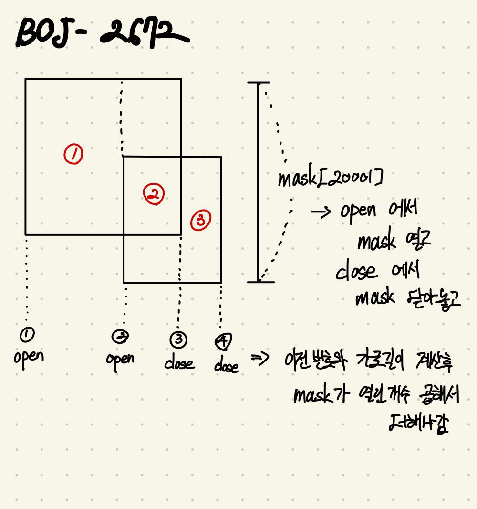

## BOJ 2672 여러 직사각형의 전체 면적 구하기

[link](https://boj.kr/2672)

### 문제

여러 개의 직사각형이 차지하는 면적을 구하는 문제이다.

### 풀이

일단 풀이는 다음과 같다.  
*~~그림도 개떡 같다.~~ 죄송해요.*  

우선, 사각형의 왼쪽과 오른쪽을 나눠서 두 개의 라인으로 저장한다. 여기서 왼쪽 라인은 open, 오른쪽 라인은 close로 저장한다.
그리고 모든 라인을 $x$ 좌표를 기준으로 정렬한다. 이후 정렬된 라인들을 차례대로 조사하며 업데이트와 계산을 한다.
코드에서는 입력받으면서 $\times$ 10을 해주는데, 소수점 처리를 위해서이다. 높이 계산을 위해 mask라는 변수를 만드는데, mask가 open(값이 1 이상)이라면 이전의 라인 중에서 사각형의 왼쪽이 있었다는 의미이다. 즉, 계산에 포함되어야 한다는 것이다.

계산은 (이전 라인과 현재 라인 사이의 거리) $\times$ (mask에서 open 되어있는 칸의 개수) 영역의 넓이를 구한다. 그냥 (가로) $\times$ (세로)다.

업데이트는 현재 조사하고 있는 라인이 open인가 close인가에 따라 mask에 기록해준다. open이라면 mask에 1을 더하고 close라면 mask에 1을 뺀다.

글의 설명을 그림에 적용해보면, 아래쪽의 1-4까지 표시된 4개의 라인을 조사하는데, mask와 라인 사이의 거리를 이용해서 (빨간색) 1번 영역에서 3번까지 구하는 것이다.  

### 소스코드

> [C++](https://github.com/Kadrick/PS/blob/main/BOJ/2672.cpp)

```cpp
/**
 * @file 2672.cpp
 * @author Kadrick (kbk2581553@gmail.com)
 * @brief sweeping
 * @version 0.1
 * @date 2022-05-03 09:11
 *
 * @copyright Copyright (c) 2022
 *
 */
#include <bits/stdc++.h>
using namespace std;
#define fastio                 \
  ios::sync_with_stdio(false); \
  cin.tie(0);
#define endl '\n'

typedef struct _RECT
{
  int x, open;     // x pos, open or close
  int bottom, top; // y pos
} Rect;

bool comp(const Rect &left, const Rect &right)
{
  if (left.x == right.x)
    return left.open < right.open;
  return left.x < right.x;
}

int n, mask[20001];
vector<Rect> pool;

int main(void)
{
  fastio;

  cin >> n;
  for (int i = 0; i < n; i++)
  {
    double x, y, w, h;
    cin >> x >> y >> w >> h;

    x *= 10;
    y *= 10;
    w *= 10;
    h *= 10;

    Rect left, right;
    left.open = 1;
    right.open = -1;

    left.x = x;
    right.x = x + w;

    left.bottom = y;
    left.top = y + h;

    right.bottom = y;
    right.top = y + h;

    pool.push_back(left);
    pool.push_back(right);
  }

  sort(pool.begin(), pool.end(), comp);

  long long ans = 0;
  int before = 0;

  for (auto &&line : pool)
  {
    // calc
    int height = 0;
    for (int i = 0; i < 20001; i++)
      if (mask[i])
        height++;

    ans += height * (line.x - before);

    // update
    for (int i = line.bottom + 1; i <= line.top; i++)
      mask[i] += line.open;
    before = line.x;
  }

  if (ans % 100)
  {
    cout << fixed;
    cout.precision(2);
    cout << ans / 100.0 << endl;
  }
  else
    cout << ans / 100 << endl;

  return 0;
}
```
